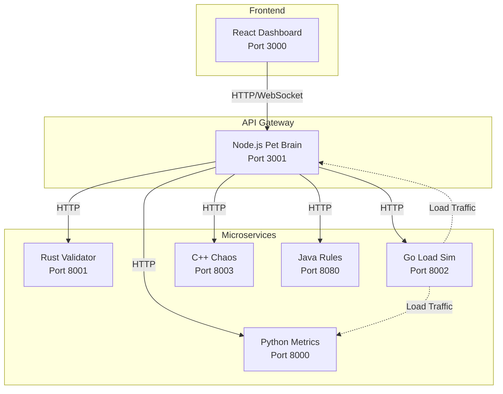

# Design Document: AliveStack - DevOps Tamagotchi

## Overview

AliveStack is a polyglot microservices system that visualizes backend health as a virtual pet. The architecture demonstrates real-world patterns using six different programming languages, each chosen for its specific strengths. All services communicate over HTTP REST APIs within a Docker network, with the Node.js API Gateway serving as the central orchestrator.

## Architecture



## Components and Interfaces

### 1. Frontend Dashboard (React)

**Technology:** React with Vite, TailwindCSS

**Responsibilities:**
- Display animated pet based on mood state
- Show real-time health metrics with progress bars
- Provide control buttons for chaos events
- Display service status indicators

**API Consumption:**
```
GET  /api/status      → Pet mood and all metrics
POST /api/chaos/cpu   → Trigger CPU stress
POST /api/chaos/memory → Trigger memory stress
POST /api/load/start  → Start load generation
POST /api/load/stop   → Stop load generation
```

### 2. Node.js API Gateway (Pet Brain)

**Technology:** Express.js, Axios, node-cron

**Port:** 3001

**Responsibilities:**
- Aggregate data from all services
- Calculate pet mood based on rules engine response
- Serve REST API to frontend
- Schedule periodic health checks

**Endpoints:**
| Method | Path | Description |
|--------|------|-------------|
| GET | /api/status | Returns complete pet status |
| GET | /api/health | Gateway health check |
| POST | /api/chaos/cpu | Proxy to C++ chaos service |
| POST | /api/chaos/memory | Proxy to C++ chaos service |
| POST | /api/load/start | Proxy to Go load simulator |
| POST | /api/load/stop | Proxy to Go load simulator |

**Response Schema (GET /api/status):**
```json
{
  "pet": {
    "mood": "HAPPY",
    "message": "All systems operational! 😄",
    "emoji": "😄"
  },
  "metrics": {
    "cpu": 23,
    "memory": 48,
    "cpuStatus": "NORMAL",
    "memoryStatus": "NORMAL"
  },
  "services": {
    "python": { "status": "healthy", "latency": 45 },
    "rust": { "status": "healthy", "latency": 12 },
    "go": { "status": "healthy", "latency": 8 },
    "cpp": { "status": "healthy", "latency": 5 },
    "java": { "status": "healthy", "latency": 67 }
  },
  "load": {
    "active": false,
    "rps": 0
  }
}
```

### 3. Python Metrics Analyzer

**Technology:** FastAPI, psutil

**Port:** 8000

**Responsibilities:**
- Collect system CPU and memory metrics
- Maintain rolling averages
- Classify metric severity

**Endpoints:**
| Method | Path | Description |
|--------|------|-------------|
| GET | /metrics | Current CPU/memory stats |
| GET | /health | Service health check |

**Response Schema (GET /metrics):**
```json
{
  "cpu": 23.5,
  "memory": 48.2,
  "cpuStatus": "NORMAL",
  "memoryStatus": "NORMAL",
  "cpuAverage": 25.1,
  "memoryAverage": 47.8
}
```

**Status Thresholds:**
- CPU: NORMAL (<60%), HIGH (60-80%), CRITICAL (>80%)
- Memory: NORMAL (<70%), HIGH (70-85%), CRITICAL (>85%)

### 4. Rust Health Validator

**Technology:** Axum, Tokio, Reqwest

**Port:** 8001

**Responsibilities:**
- Ping all services and measure latency
- Detect slow or unresponsive services
- Validate response data integrity

**Endpoints:**
| Method | Path | Description |
|--------|------|-------------|
| GET | /validate | Validate all services |
| GET | /health | Service health check |

**Response Schema (GET /validate):**
```json
{
  "services": {
    "python": {
      "status": "healthy",
      "latency_ms": 45,
      "last_check": "2024-01-15T10:30:00Z"
    },
    "go": {
      "status": "slow",
      "latency_ms": 650,
      "last_check": "2024-01-15T10:30:00Z"
    }
  },
  "overall": "degraded"
}
```

**Status Classification:**
- healthy: response < 500ms
- slow: response 500-3000ms
- offline: no response or timeout > 3000ms

### 5. Go Load Simulator

**Technology:** Gin, goroutines

**Port:** 8002

**Responsibilities:**
- Generate concurrent HTTP requests
- Report load statistics
- Graceful start/stop of load generation

**Endpoints:**
| Method | Path | Description |
|--------|------|-------------|
| POST | /load/start | Start load generation |
| POST | /load/stop | Stop load generation |
| GET | /load/status | Current load stats |
| GET | /health | Service health check |

**Request Schema (POST /load/start):**
```json
{
  "rps": 100,
  "target": "http://api:3001/api/health"
}
```

**Response Schema (GET /load/status):**
```json
{
  "active": true,
  "targetRps": 100,
  "actualRps": 98,
  "totalRequests": 5840,
  "successCount": 5820,
  "failCount": 20,
  "successRate": 99.66
}
```

### 6. C++ Chaos Engine

**Technology:** cpp-httplib, standard library

**Port:** 8003

**Responsibilities:**
- CPU stress testing
- Memory allocation stress
- Safe resource limits

**Endpoints:**
| Method | Path | Description |
|--------|------|-------------|
| POST | /chaos/cpu | Burn CPU for N seconds |
| POST | /chaos/memory | Allocate N MB temporarily |
| GET | /health | Service health check |

**Request Schema (POST /chaos/cpu):**
```json
{
  "duration_seconds": 10
}
```

**Response Schema:**
```json
{
  "type": "cpu_burn",
  "duration_seconds": 10,
  "completed": true
}
```

**Safety Limits:**
- Max CPU burn: 30 seconds
- Max memory allocation: 256 MB
- Auto-release after operation

### 7. Java Rules Engine

**Technology:** Spring Boot (minimal)

**Port:** 8080

**Responsibilities:**
- Evaluate mood rules
- Return mood with explanation
- Consistent rule application

**Endpoints:**
| Method | Path | Description |
|--------|------|-------------|
| POST | /rules/evaluate | Evaluate metrics and return mood |
| GET | /health | Service health check |

**Request Schema (POST /rules/evaluate):**
```json
{
  "cpu": 23,
  "memory": 48,
  "errorRate": 0,
  "serviceHealth": {
    "healthy": 5,
    "degraded": 0,
    "offline": 0
  }
}
```

**Response Schema:**
```json
{
  "mood": "HAPPY",
  "emoji": "😄",
  "reason": "All systems operational!",
  "severity": 0
}
```

**Mood Rules (Priority Order):**
1. Any service offline → SICK 🤒 (severity: 4)
2. CPU > 90% → ANGRY 😠 (severity: 3)
3. Error rate > 10% → SAD 😢 (severity: 3)
4. Memory > 85% → WORRIED 😰 (severity: 2)
5. Any service slow → NEUTRAL 😐 (severity: 1)
6. All normal → HAPPY 😄 (severity: 0)

## Data Models

### PetStatus
```typescript
interface PetStatus {
  mood: 'HAPPY' | 'NEUTRAL' | 'WORRIED' | 'SAD' | 'ANGRY' | 'SICK';
  emoji: string;
  message: string;
  severity: number;
}
```

### SystemMetrics
```typescript
interface SystemMetrics {
  cpu: number;
  memory: number;
  cpuStatus: 'NORMAL' | 'HIGH' | 'CRITICAL';
  memoryStatus: 'NORMAL' | 'HIGH' | 'CRITICAL';
}
```

### ServiceHealth
```typescript
interface ServiceHealth {
  status: 'healthy' | 'slow' | 'offline';
  latency: number;
  lastCheck: string;
}
```

### LoadStatus
```typescript
interface LoadStatus {
  active: boolean;
  targetRps: number;
  actualRps: number;
  totalRequests: number;
  successCount: number;
  failCount: number;
  successRate: number;
}
```

## Error Handling

### Service Timeout Strategy
- All inter-service calls have 3-second timeout
- Failed services marked as "offline" in status
- Pet mood degrades gracefully based on failures

### Circuit Breaker Pattern (Node.js Gateway)
- Track consecutive failures per service
- After 3 failures, mark service as "circuit open"
- Retry after 30 seconds
- Prevents cascade failures

### Graceful Degradation
- If Python metrics fails → use cached values
- If Rust validator fails → skip validation, warn user
- If Java rules fails → use default mood calculation in Node.js
- If Go load fails → disable load testing feature
- If C++ chaos fails → disable chaos buttons

## Testing Strategy

### Unit Tests
- **Node.js:** Jest for API route handlers and mood calculation
- **Python:** pytest for metrics collection and classification
- **Rust:** cargo test for validation logic
- **Go:** go test for goroutine management
- **Java:** JUnit for rule evaluation

### Integration Tests
- Docker Compose test environment
- Test service-to-service communication
- Verify mood changes based on simulated conditions

### Manual Testing Scenarios
1. Start all services → Pet should be HAPPY
2. Trigger CPU chaos → Pet should become ANGRY
3. Stop a service → Pet should become SICK
4. Generate high load → Observe pet mood changes

## Project Structure

```
alive-stack/
├── frontend/
│   ├── src/
│   │   ├── components/
│   │   │   ├── Pet.jsx
│   │   │   ├── HealthBars.jsx
│   │   │   ├── ServiceStatus.jsx
│   │   │   └── ControlPanel.jsx
│   │   ├── App.jsx
│   │   └── main.jsx
│   ├── package.json
│   ├── vite.config.js
│   └── Dockerfile
│
├── api-node/
│   ├── src/
│   │   ├── index.js
│   │   ├── routes/
│   │   └── services/
│   ├── package.json
│   └── Dockerfile
│
├── metrics-python/
│   ├── main.py
│   ├── requirements.txt
│   └── Dockerfile
│
├── validator-rust/
│   ├── src/
│   │   └── main.rs
│   ├── Cargo.toml
│   └── Dockerfile
│
├── load-go/
│   ├── main.go
│   ├── go.mod
│   └── Dockerfile
│
├── chaos-cpp/
│   ├── main.cpp
│   ├── CMakeLists.txt
│   └── Dockerfile
│
├── rules-java/
│   ├── src/main/java/
│   ├── pom.xml
│   └── Dockerfile
│
├── docker-compose.yml
└── README.md
```

## Docker Configuration

### Resource Limits (per container)
```yaml
deploy:
  resources:
    limits:
      cpus: '1.0'
      memory: 512M
```

### Network Configuration
- Single bridge network: `alive-stack-network`
- Services communicate via container names
- Only frontend exposed to host

### Health Checks
Each service includes Docker health check:
```yaml
healthcheck:
  test: ["CMD", "curl", "-f", "http://localhost:PORT/health"]
  interval: 30s
  timeout: 10s
  retries: 3
```
